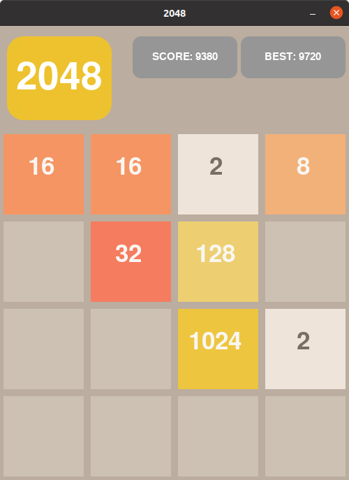

# `2048 pygame`

A simple clone of game 2048 using `numpy` and `pygame`.  
Player can choose if wants to play by himself or want to watch  
game being beaten by a bot.  
Bots implemented:
 -  **Monte Carlo Tree Search**
- TO DO: ***Finish DQN Bot Implementation***
----
Project is using `python >= 3.8`.  
Install required packages using pip command:
```
pip install -r requirements.txt
```
---
After installation completed successfully game can be run using command:
```
python main.py
```
To run unittests for game's logic, bots and OpenAI gym 
environment 2048 implementation execute:
```
python -m unittest
```
---

